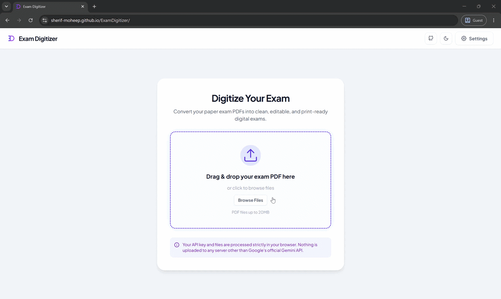
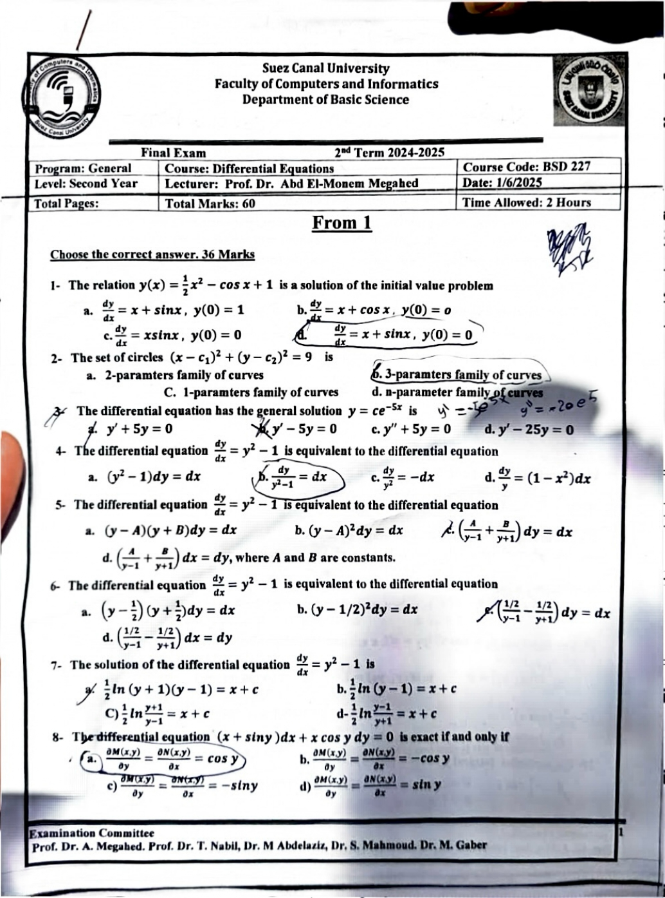
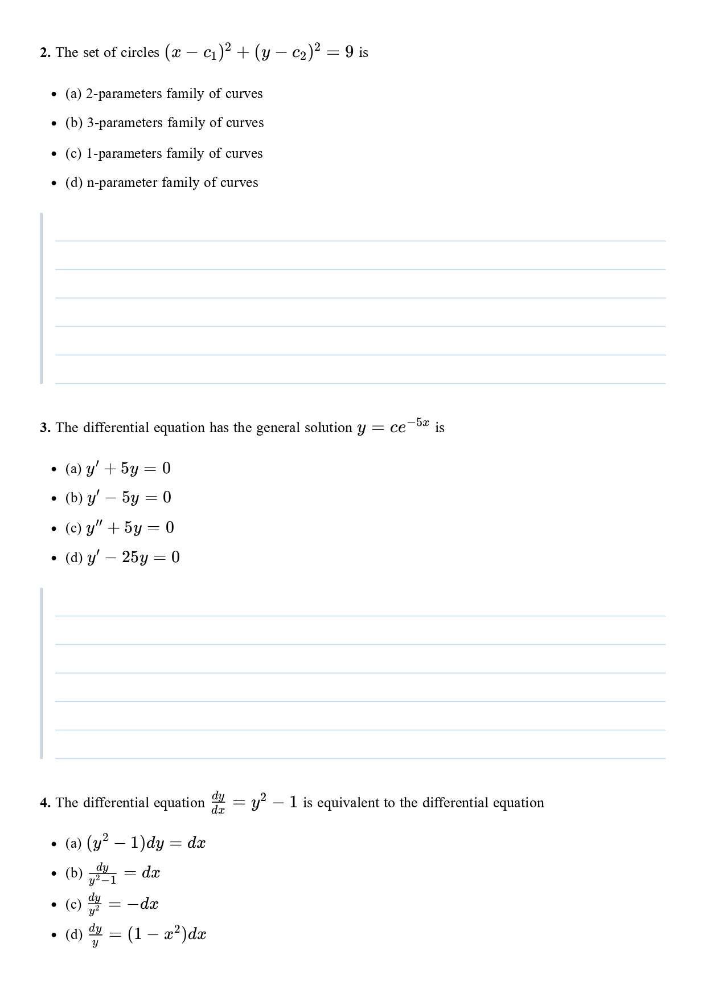
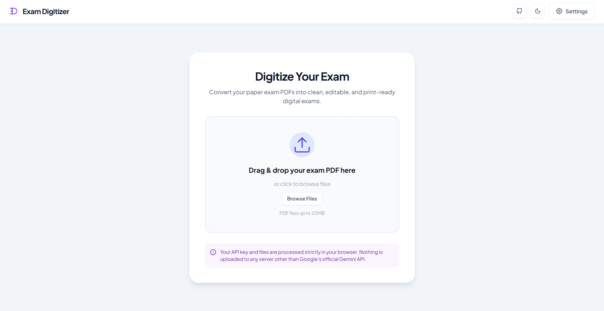
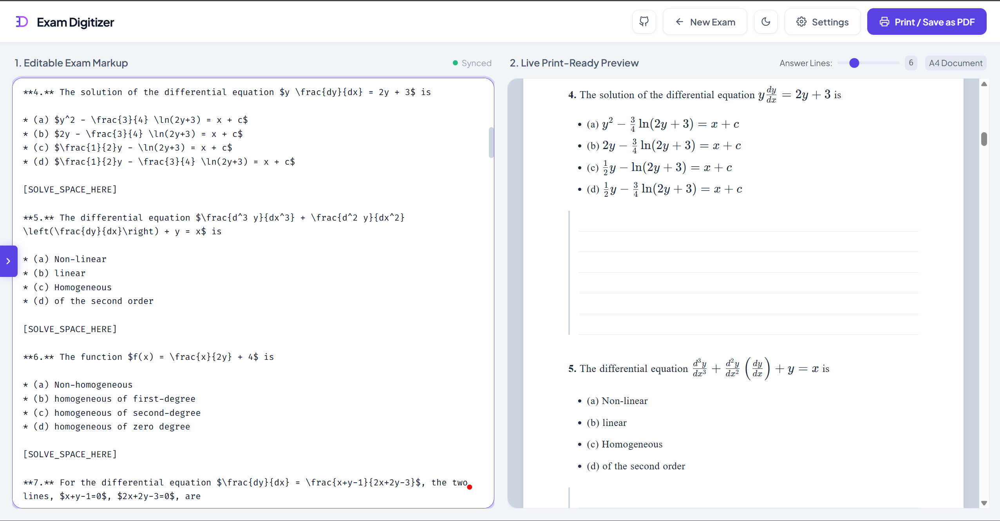
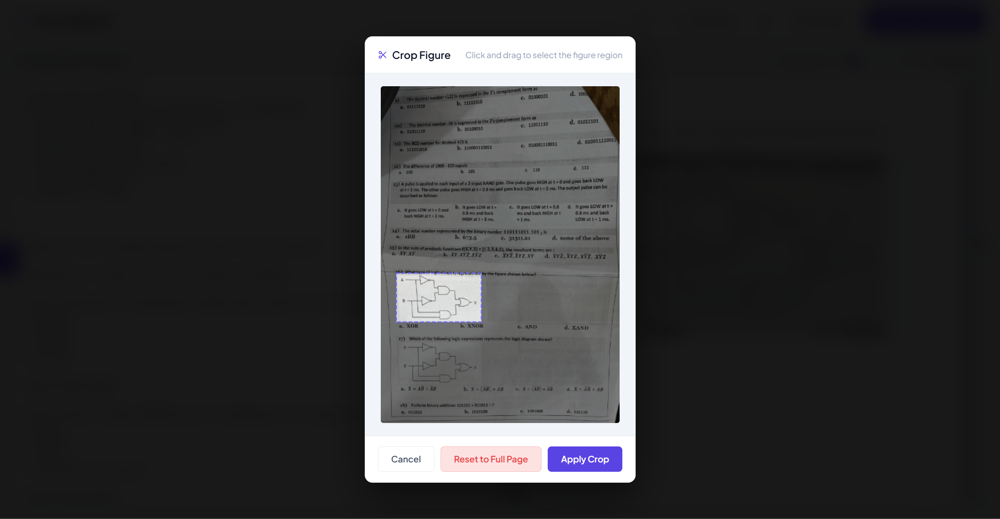
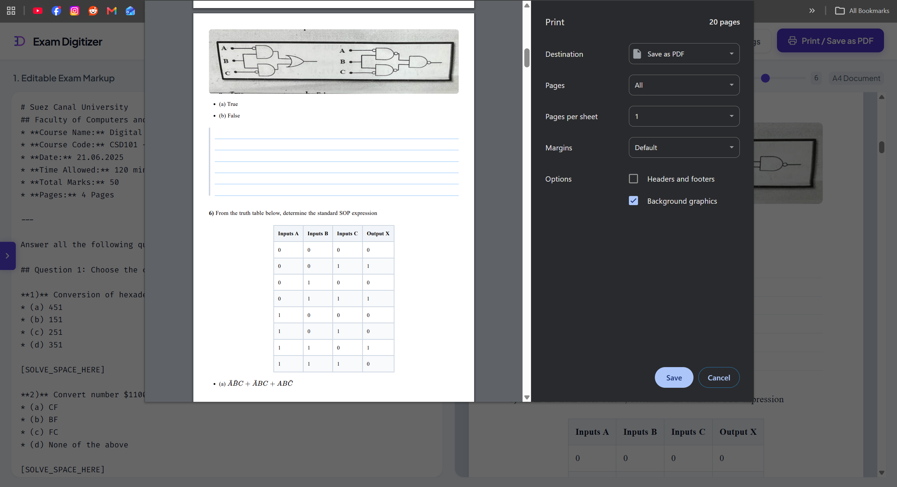

<div align="center">
  

# Exam Digitizer

**Transform cluttered scanned PDF exams into clean, editable Markdown and print-ready study worksheets.**

</div>

---

## 💡 The Motive

I prefer solving past-paper exams on a graphic tablet, but most available past papers are low-quality scanned PDFs compiled from mobile photos. Because these photos were taken by students after sitting the exams, they are frequently cluttered with handwritten solutions, pencil scribbles, grader checkmarks, and scanner noise.

Working with these messy files introduced significant friction into my study routine—forcing me to manually screenshot individual questions and clean them up inside note-taking apps just to create a usable workspace.

I built **Exam Digitizer** to eliminate this friction. It transcribes scanned PDF exams using **Google Gemini LLMs** (which automatically strip out handwritten notes and student scribbles), converts mathematical notation into LaTeX, and extracts diagrams via an interactive canvas cropper. You can insert customizable **solve spaces** under questions, rendering the exam into a clean, A4-formatted, print-ready PDF with ample room to write.

---

## 🖼️ Visual Preview

### ⚡ Quick Demo

<!-- Replace demo.gif with your actual recorded GIF or MP4 video link -->



---

### 🔄 Before & After Transformation

|                   📄 Original Scanned PDF (Handwritten Noise & Scribbles)                   |                    ✨ Digitized A4 Worksheet (Clean Markdown & KaTeX Math)                     |
| :-----------------------------------------------------------------------------------------: | :--------------------------------------------------------------------------------------------: |
|  |  |

---

### 📸 Key Application Features

|                1. Multimodal AI Digitization                |              2. Live Split-Pane & KaTeX Math              |
| :---------------------------------------------------------: | :-------------------------------------------------------: |
|  |  |
|   _Upload scanned PDF, set API key & choose Gemini model_   |              _Side-by-side Markdown editor_               |

|          3. Interactive Canvas Figure Cropping          |         4. Customizable Solve Spaces & A4 Export         |
| :-----------------------------------------------------: | :------------------------------------------------------: |
|        |    |
| _Crop diagrams & graphs directly from source PDF pages_ | _Dynamically tune writing lines and export clean A4 PDF_ |

---

## 📖 Technical Documentation

### ⚙️ Tech Stack & Architecture

Exam Digitizer is built using **Clean Architecture** principles to separate core domain business logic, data services, and presentation UI components.

| Layer                  | Technologies & Libraries                      | Functionality & Role                                                                                    |
| :--------------------- | :-------------------------------------------- | :------------------------------------------------------------------------------------------------------ |
| **Frontend Framework** | `React 18.3`, `TypeScript 5.2`, `Vite 5.2`    | Single-page application, type-safe development, fast state updates, and instant HMR                     |
| **Styling & UI**       | `TailwindCSS 3.4`, Custom CSS & Print Engine  | Responsive glassmorphism interface, custom CSS themes, and native A4 `@media print` layout rendering    |
| **Multimodal AI**      | `@google/generative-ai` (Gemini API)          | Automated vision-based PDF transcription, noise & scribble stripping, and LaTeX mathematical conversion |
| **PDF Processing**     | `pdfjs-dist`                                  | In-browser PDF rendering, viewport canvas manipulation, and interactive figure cropping                 |
| **Markdown & Math**    | `markdown-it`, `markdown-it-texmath`, `katex` | High-performance Markdown compilation with embedded LaTeX math notation rendering                       |

---

### 📝 Document Structure & Formatting Syntax

Exam Digitizer combines standard Markdown formatting and KaTeX LaTeX math with specialized extension tags tailored for exam papers, solve spaces, and figure cropping.

#### 1. Core Markdown & Math Syntax

| Feature                     | Raw Markdown Syntax                          | Rendered Visual Output                            | Description                                                                         |
| :-------------------------- | :------------------------------------------- | :------------------------------------------------ | :---------------------------------------------------------------------------------- |
| **Exam Header & Title**     | `# Institution Name`<br>`## Department Name` | <h1>Institution Name</h1><h2>Department Name</h2> | Main exam title (`#`) and section sub-headings (`##`).                              |
| **Question Numbering**      | `**1.** Solve for $x$`                       | **1.** Solve for $x$                              | Bold paragraph prefix (`**1.**` or `**Question 1:**`) formats clean question cards. |
| **Multiple-Choice Options** | `* (a) Option A`<br>`* (b) Option B`         | • (a) Option A<br>• (b) Option B                  | Bulleted list items for choice options.                                             |
| **Inline Math**             | `$f(x) = ax^2 + bx + c$`                     | $f(x) = ax^2 + bx + c$                            | Single dollar signs render inline KaTeX math formulas.                              |
| **Block / Display Math**    | `$$\int_{a}^{b} f(x) dx$$`                   | $$\int_{a}^{b} f(x) dx$$                          | Double dollar signs render centered block math formulas.                            |

#### 2. Custom Extension Tags

| Syntax Tag              | Example Code Tag                     | Description & Behavior                                                                                                   |
| :---------------------- | :----------------------------------- | :----------------------------------------------------------------------------------------------------------------------- |
| **Default Solve Space** | `[SOLVE_SPACE_HERE]`                 | Inserts default number of ruled handwriting lines (e.g. 6 lines) under questions.                                        |
| **Custom Line Count**   | `[SOLVE_SPACE:N]`                    | Inserts exactly `N` handwriting lines (e.g., `[SOLVE_SPACE:12]` for long-answer solutions).                              |
| **Page Break**          | `[PAGE_BREAK]` or `\pagebreak`       | Forces an explicit page boundary when printing or exporting A4 PDF.                                                      |
| **Figure Reference**    | `[FIGURE:P:Y1,X1,Y2,X2:description]` | Defines a figure crop marker linked to PDF page coordinates (`0-1000` scale). Renders an interactive canvas crop button. |

---

## 🚀 Getting Started

You can use **Exam Digitizer** directly in your browser via the live online version or run it locally on your machine.

### 🌐 Method 1: Live Web App (Try it Online)

No installation or environment setup required!

1. **Open the App**: Launch the [Live Exam Digitizer App](https://sherif-moheep.github.io/ExamDigitizer/) in any modern web browser.
2. **Configure API Key**: Click the **Settings** icon to enter your **Google Gemini API Key** (obtainable free from [Google AI Studio](https://aistudio.google.com/)). _Your API key is saved locally in browser storage and is never sent to any backend server._
3. **Upload PDF Exam**: Drag & drop your scanned PDF exam into the upload zone.
4. **Digitize & Fine-Tune**: Choose your preferred Gemini model (e.g. `Gemini 3.6 Flash`), click **Digitize Exam**, interactively crop diagrams, adjust solve space writing lines, and export clean A4 PDFs.

---

### 💻 Method 2: Local Development Setup

To run, build, or contribute to Exam Digitizer locally on your machine:

#### Prerequisites

- **Node.js** v18.0 or higher
- **npm** v9.0 or higher

#### Quickstart Commands

```bash
# 1. Clone the repository
git clone https://github.com/Sherif-Moheep/ExamDigitizer.git
cd ExamDigitizer-React

# 2. Install dependencies
npm install

# 3. Start the local development server
npm run dev

# 4. Open in browser
# Open the local URL printed in your terminal (typically http://localhost:5173)

# 5. Build for production release
npm run build
```

---

## 🔒 Privacy & Security

- **100% Client-Side Processing**: PDF files and cropped figures are processed locally inside your browser memory using PDF.js.
- **Secure Key Storage**: Your Google Gemini API Key is saved exclusively in your browser's `localStorage`. It is only transmitted directly to Google's official Gemini API endpoints (`generativeai.googleapis.com`) and never shared with or stored on any intermediate server.

---

## 🤝 Contributing

Contributions, feature requests, and bug reports are welcome!

1. **Fork the Repository** (`https://github.com/Sherif-Moheep/ExamDigitizer`)
2. **Create a Feature Branch** (`git checkout -b feature/AmazingFeature`)
3. **Commit Your Changes** (`git commit -m 'Add some AmazingFeature'`)
4. **Push to Branch** (`git push origin feature/AmazingFeature`)
5. **Open a Pull Request**
